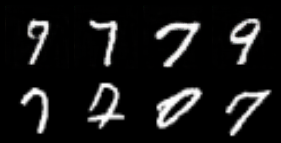

# Convlutional Generative Adversarial Network (ConvGAN)

## 1. Runtime Environment
```
python              3.8
EasyLossUtil        0.10
numpy               1.24.4
pandas              2.0.3
pillow              10.4.0
scikit-learn        1.3.2
scipy               1.10.1
torch               1.12.0+cu113
torchaudio          0.12.0+cu113
torchinfo           1.8.0
torchvision         0.13.0+cu113
tqdm                4.67.1
```

## 2. Contents
### 2.1 DCGAN
- Unsupervised Representation Learning with Deep Convolutional Generative Adversarial Networks

### 2.2 WGAN
- Wasserstein GAN

### 2.3 WGAN-GP
- Improved Training of Wasserstein GANs
  
## 3. Results
### 3.1 DCGAN
I train the DCGAN on MNIST dataset with 1849 epoch.

The hyper-parameters are as follows:
```
img_size: 64
in_c: 3
norm_type: n2
batch_size: 128
g_lr: 1e-06
d_lr: 1e-06
latent_dim: 256
```

The GPU is RTX 3090.
Each epoch costs about 45 second.




